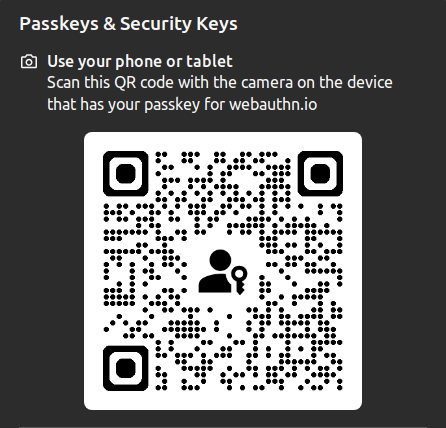
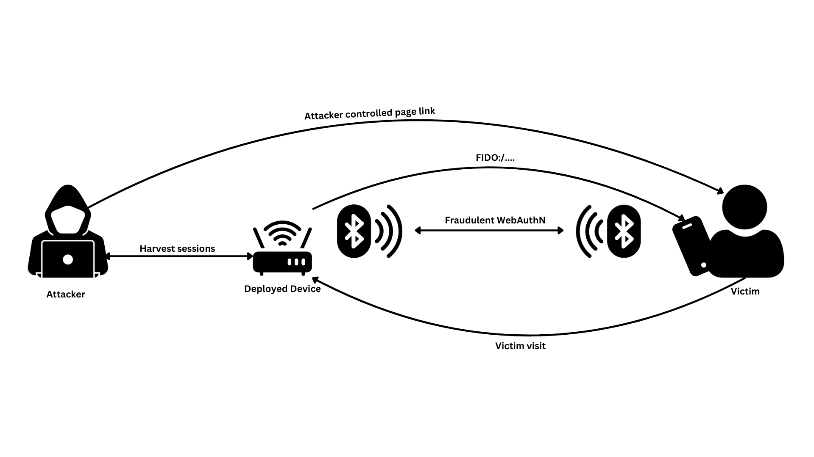

In this blogpost I will go over a vulnerability I found in all major mobile browsers that allowed an attacker within Bluetooth range to take over PassKeys accounts by triggering `FIDO:/` intents.

**TLDR** An attacker within bluetooth range is able to trigger navigation to a `FIDO:/` URI from an attacker controlled page on a mobile browser, allowing them to initiate a legitimate PassKeys authentication intent which will be received on the attacker's device. This results in the attacker being able to "phish" PassKeys credentials, completely breaking this assumption that PassKeys are impossible to phish.

## Prelude

While I was completing my research [exploiting BankID authentication](https://mastersplinter.work/research/bankid) and other Cross-Device authentication protocols (which I hope to also publish soon), one thought had always haunted me: "Why did these companies go through the trouble of implementing all this stuff when PassKeys are clearly supporting their use cases?". I simply thought this because it seemed to me that if one wanted a secure way to provide Cross-Device authentication to their users, the obvious and most secure option would be PassKeys. I still think this is true, however it made me realize that maybe PassKeys security was worth looking into.

## PassKeys Research Ideas

I wanna keep this blogpost relatively short and about the vulnerability itself, however I think it might be interesting for the community if I dropped some security key concepts that I think are interesting that I ended up looking into during my research. 

- [Multiple origins](https://passkeys.dev/docs/advanced/related-origins/) Could be interesting if the origins are too permissive and an attacker can use an origin to phish the user, also adds additional impact for subdomain takeovers.
- Adding a PassKey to attacker account, however using a victim's email, if validation is not present by server, ATO is possible.
- General CSRF during registration, pushing attacker's public key instead of victim.
- If an attacker manages to retrieve a credential ID of a victim and register a new credential with the same credential ID but with the attacker’s username, the victim’s credential gets overwritten. This can cause the legitimate user not to be able to log in to their account with their passkey.
- `userVerification` mis-check https://hwsecurity.dev/2020/08/webauthn-pin-bypass/
- To protect against phishing attacks, the relying party must ensure that the "origin" value in the `clientDataJSON` object is in a whitelist of acceptable origins, as failure to do so could allow attackers to misuse valid credentials obtained from victims.


These are just some points that I have looked into during my research that took me down the PassKeys rabbit-hole, I think a lot of these should be further explored, especially by looking at specific implementations in different web-applications and common WebAuthn libraries. 

These points have one thing in common, origin bypasses. To put it simply, when a web application wants to make use of PassKeys to authenticate a user it must tell the browser which origins (or RP) are allowed to register and request credentials for that site. Otherwise any origin would be able to tell your browser "heeeeeey, fetch me credentials for yourbankthattotallydoesnotsupportpasskeys.com and authenticate this user pls", this to me seemed like the clear security boundary that I should try to break.

Although these are all pretty valid ways to achieve Account Takeover by exploiting PassKeys implementations, they rely on misconfigurations (most of the times multiple required) on the webapp's implementation. So I decided that my goal was gonna be to prove that **PassKeys are phishable**.

## Client to Authenticator Protocol via BLE

The WebAuthn CTAP standard describes how the Client, which in our case is a Browser, and the Authenticator should communicate securely in order to authenticate users. The Authenticator can come in different shapes and sizes, however the most common devices used are USB keys (like a Yubikey) and mobile phones. These can communicate via USB, serial, NFC, WiFi, BLE and probably more and more ways as browser support keeps expanding. 

Since I'm not smart enough to explain to you exactly how this works, I will give you the one sentence (which I cannot remember where I read) that has helped me understand all of this:

> WebAuthn is just SSH (privkey-pubkey) for the web.
>
> *- the wisest man on the internet*

What really peaked my interest was the BLE delivery method, this is because in order to implement a secure Cross-Device Authentication flow (which is when credentials that reside in another device are used to authenticate you to a service you are using on your main device), ensuring physical proximity to the requesting device is key to make this flow "phishproof". This because otherwise page proxy attacks (where the legitimate page gets proxied to a phishing site) and CSRF-like attacks are possible, taking us back to square one and **making your fancy auth flow just a glorified username+password page**.

Anyway I digress, BLE is a good way to ensure physical proximity because your authenticator and client must be within BLE range of each other to complete the authentication, making attacks like [BankID Hijacking](https://mastersplinter.work/research/bankid/) not possible.

### The good, the bad, the QR Code

The way a web application tells the browser (Client) to start a WebAuthn authentication is using the javascript call: `navigator.credentials.get` passing the RP's public key returned by the backend like so:

```js
navigator.credentials.get({
    publicKey: credentialRequestOptions.publicKey
})
```

On supported browsers this will popup a browser built-in prompt (which the page is not in control) where the user will be able to select his Authenticator. In the case of BLE, the browser will generate a QR code and display it in the popup.






The flow is pretty simple:

1. User scans the QR code
2. Mobile phone OS' PassKey manager processes the QR code data
3. The BLE connection is made
4. The browser communicates a random challenge (generated by the backend) for the Authenticator to sign with the private key
5. The Authenticator sends the signed challenge back
6. The browser sends everything back to the backend and boom you are logged in

Of course I'm extremely over-simplifying, but you get the gist (or ghist?). However I purposefully omitted step 1.5, how does the the OS knows to open the PassKey manager? Well of course **intents** (also known as deep-links)! 

## FIDO:/ Intents

I think you might already know where I'm going with this, essentially the QR code contains a `FIDO:/1308640083810730366733271901259...` URI. This is a special scheme reserved for WebAuthn containing a base-10 encoded string, when decoded this yields a CBOR blob (yet another way to serialize stuff, used by WebAuthn standard) containing data the Authenticator requires to start processing the authentication request and communicating with the Client. The CBOR blob contains:

- Compressed public key of relying party
- QR code secret (so you can't just hijack the BLE connection I believe)
- Number of registered domains (how many Relying Party (RP) domains this passkey is currently associated with or recognized for)
- Timestamp
- Request type (login/signup essentially)
- WebAuthn non discoverable flag (allows for "username-less" login flows)

The minute I realized this I had to try to trigger this intent from a mobile browser cross-origin. And it worked!

## Phishing PassKeys

Now that all the pieces have come together, let's look at how an attacker can phish PassKeys from mobile browsers. There are two clear prerequisites for this attack to work against a victim on a mobile device:
- An attacker controlled (evil) device within BLE range (< 100m)
- A victim visiting an attacker controlled page

The latter one is barely a requirement, given the scope of this research, however let's leave it there. Here are the attack steps assuming those two requirements are met, we will discuss more realistic attack scenarios further on:

1. Victim clicks on link in the attacker controlled page
2. The attacker's device visits the login page of the RP the account should be stolen for, and initiates a WebAuthn authentication
3. The attacker's device extracts the fresh `FIDO:/` link from the QR code and redirects the victim to it
4. The victim's PassKey manager pops up and the background page gets redirected to the legitimate RP site (lots of browser tricks to do this)
5. The victim's Authenticator connects to the attacker's Client
6. The victim presses "Ok" or "Continue" (most devices are one click only + biometrics, if you use facial recognition it is basically a one click)
7. The attacker's device is now signed in as the victim on the target RP

Here is a diagram of how those steps would look like:





Step 2 and 3 are automated using a headless browser, it is possible to simply define the actions to be taken by then browser, trigger the WebAuthN request and then extract the `FIDO:/`. I have built a tool for testing these kind of bugs, you can find it updated with the code necessary for FIDO at [https://github.com/Splinter0/CrossCheck](https://github.com/Splinter0/CrossCheck). 

What the tool does is set up a web server that hosts the malicious page, as well as the headless browser implementation. When a victim visits the malicious page the headless browser will trigger and redirect the victim to the extracted URI. This works for a bunch of different attacks, so I encourage you to go check it out and see what kind of creative attacks you can come up with.

It should be noted that this entire attack can be done through a small device like a raspberry pi, allowing the attacker to drop such devices where they wish and control them remotely, harvesting sessions without having to be in the vicinity.

## CVE-2024-9956

All major mobile browsers were found vulnerable, in this case the vulnerability is simply allowing `FIDO:/` intents to be triggerable by a page. All fixes consisted in blacklisting such URIs from being navigable. Safari, Chrome and Firefox Mobile were all found vulnerable, below follow the video PoCs all done against the test RP [https://webauthn.io/](https://webauthn.io/) 

**Insert videos**

- [https://nvd.nist.gov/vuln/detail/CVE-2024-9956](https://nvd.nist.gov/vuln/detail/CVE-2024-9956)
- [https://issues.chromium.org/issues/370482421](https://issues.chromium.org/issues/370482421)

## Attack Scenarios

Some RPs allow users to simply click, "Login with PassKeys" before entering their username/email, this is ideal for this attack as it allows a malicious actor to deliver this attack at scale. Every victim will be prompted to select their PassKey, without the attacker requiring previous knowledge or phish the victim for their email. However I believe both a valid attack scenarios and below I will try to explain them with two realistic examples.

### AirPort Free Wi-Fi

Here the attacker has set-up the automated browser steps for multiple social logins, such as Apple, Google and perhaps LinkedIn (just picking random socials that use passkeys, also these happen to force you to pick an email before proceeding with passkeys). The attacker will drop his malicious device in a crowded area, such as an airport, and advertise a Wi-Fi access point with a login screen.

The login screen will ask the victims for their email, after that it will provide them with a choice to "Login with social network to enjoy free Wi-Fi!". After the victim chooses an option, the attack will start and the victim will be redirected to the `FIDO:/` url, handing over their valid sessions to the attacker if they were to fall for the phish. The attacker will simply use the email entered on the previous phishing step to start the WebAuthN authentication on the targeted RP.

### The Crypto Heist

This scenario describes a much more targeted attack in which the attacker carefully plans to strike against a single victim. Let's imagine *Bob*, now *Bob* is a crypto gazillionare and takes security pretty seriously, although he does not know much about it. However what he does know is that PassKeys are un-phishable (*Bob* clearly did not read this blogpost) so he sets one up for his favorite crypto exchange and always uses it to login. 

Little does he know that the attacker has done a lot of OSINT on him, they know his email address and which is his favorite cafè. When he isn't paying attention the attacker, who also deserves a name so we'll call her *Alice*, slips a raspberry pi pico equipped with a GSM and BLE module into his backpack. This will allow the attack tool to run entirely on the pi, hosting the malicious page as well (although not necessary) by tunneling traffic using something like Cloudflare Tunnels.

*Alice* buys a domain that looks like *Bob*'s crypto exchange domain where the malicious page will be hosted. She sends a convincing phishing email as *Bob* heads home, he clicks on it promptly as it reads "Your account is under attack!", logs in with his PassKey and... what? The login did not work.

*Alice* meanwhile is safely back home, remotely controlling the pi, she extracts the session from the headless browser and helps herself to all of *Bob*'s coins.

The end.

## Conclusion

Ok I got a little bit carried away there with the story.

I would like to give special thanks to all the browsers teams for fixing this issue relatively quickly. 

If you are looking to get into PassKeys security, I will drop here some sources that helped me, hopefully I will be able to write something more comprehensive in the future about WebAuthN security.

**Hack the planet!**

## Helpful Resources

- [All libraries](https://passkeys.dev/docs/tools-libraries/libraries/)
- [API standard](https://www.w3.org/TR/webauthn-2/)
- [Intents Research by NDevTK](https://ndevtk.github.io/writeups/2024/08/01/awas/)
- [Attacks on FIDO2 paper](http://essay.utwente.nl/98532/1/Chen_MA_EEMCS.pdf)
	- Page 13, `attestationObject`
	- [Security consideations from standard](https://www.w3.org/TR/webauthn-2/#sctn-security-considerations)
	- [What the RPs SHOULD do](https://www.w3.org/TR/webauthn-2/#sctn-rp-operations)
	- [Security considerations of FIDO2 itself?](https://fidoalliance.org/specs/fido-v2.0-id-20180227/fido-security-ref-v2.0-id-20180227.html)
	- [Related work](https://ieeexplore.ieee.org/document/10179454)
- [Another paper with good testing tool](https://isyou.info/jowua/papers/jowua-v13n2-4.pdf)
- [Directory](https://passkeys.directory/) Services that have implemented passkeys
- [More targets](https://www.yubico.com/works-with-yubikey/catalog/?protocol=5&sort=popular)
- [Conformance testing](https://fidoalliance.org/certification/functional-certification/conformance/)
- [Virtual authenticator for easier testing](https://developer.chrome.com/docs/devtools/webauthn/)
- [Cool github issue with security considerations](https://github.com/keepassxreboot/keepassxc/issues/10287)
- [How FIDO2 url works](https://stackoverflow.com/questions/73224907/what-information-does-fido2-url-contain-and-how-can-we-decode-it-in-swift)
- [PassKey BLE bruteforce](https://insinuator.net/2021/10/change-your-ble-passkey-like-you-change-your-underwear/)
	- [https://github.com/ttdennis/bluetooth_smp_pocs](https://github.com/ttdennis/bluetooth_smp_pocs)
- [Cool testing tool](https://www.passkeys-debugger.io)
- [Chromium code for BLE fido](https://source.chromium.org/chromium/chromium/src/+/main:device/fido/cable/v2_handshake.cc;l=508;drc=c879c659bc5f5bc899d3a1608d5e9155b80bc90c)
- [Getting the .well-known endpoints](https://android-developers.googleblog.com/2023/10/make-passkey-endpoints-well-known-url-part-of-your-passkey-implementation.html)
- [More chromium code](https://github.com/chromium/chromium/blob/59416ca0605cbf582c06204d662124b7e6c2ee4f/device/fido/cable/v2_handshake.cc#L309)
- [CVE-2021-38299](https://github.com/advisories/GHSA-6whf-q6p5-84wg)
- [CVE-2022-42731](https://github.com/advisories/GHSA-vw39-2wj9-4q86)
